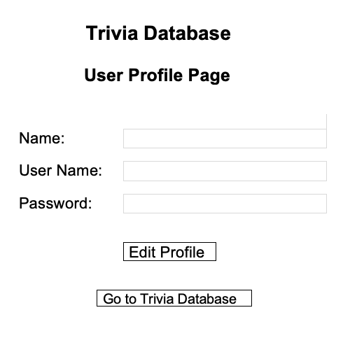
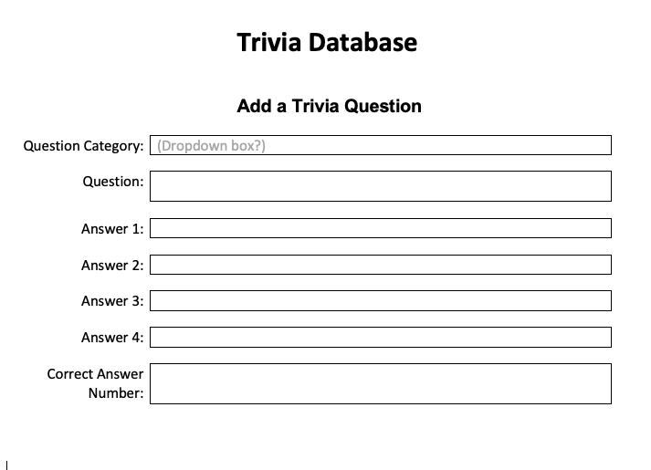

## Trivia Database Application

## Trivia Application Description

### User Stories

1. The application needs to give users access to the Trivia database which can be used in a multiple choice trivia game.
2. Application should enable the user to log in to use the application.
3. It needs to enable the user to view a list of trivia questions.
4. While viewing the list of trivia questions, the user should be able to click on a question to view all the data regarding that specific trivia question.
5. While viewing the trivia question, the user should have the option to edit and update the question.
6. Users also need to be able to add a new trivia question.
7. All trivia questions need to be assigned to a trivia category.
8. The user should have the ability to delete any specified trivia question.

**Wireframe Images Used In This Project**

1. Check out your `config/config.json` file. You'll need to create a database called `project2_development`
1. Sequelize is included in the app. You have a `User` model. Run `db:migrate` to create the `Users` table in your database.
1. Run `nodemon` and go to the Homepage: `localhost:3000/`

 

## Routes

You have the following routes available.

#### controllers/authController.js

- GET and POST `localhost:3000/auth/signup`
- GET and POST `localhost:3000/auth/login`
- GET `localhost:3000/auth/logout`

#### controllers/usersController.js

- GET `localhost:3000/profile/:id`

 

## Additional Resources

- [Fruit App Solution](https://git.generalassemb.ly/jdr-0622/fruit-app-in-class)
- [Pokemon Express Solution](https://git.generalassemb.ly/jdr-0622/pokemon-express-sequelize6)
- [Google Routes Spreadsheet](https://docs.google.com/spreadsheets/d/14-LHKXLtEkp_vKEz3qSKjREnrmSyzQ9fimTlmrPsZsQ/edit#gid=0)
- [JSON Web Tokens](https://jwt.io/)
