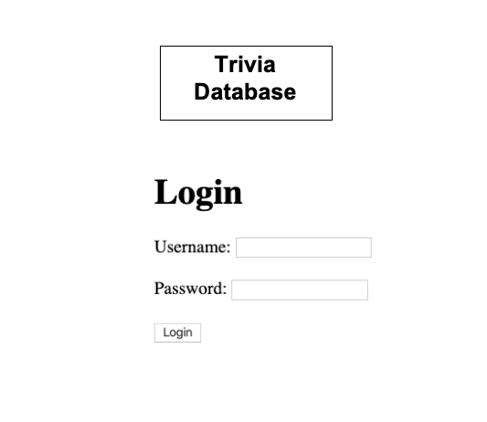

## Trivia Database Application

## Trivia Application Description

This application maintains a database used by a multiple choice trivia game. It enables a user to create a trivia question along with 4 possible answers, including a field to indicate the correct answer. It also enable the user to assign each trivia question to a specific trivia category.

### User Stories

1. The application needs to give users access to the Trivia database which can be used in a multiple choice trivia game.
2. Application should enable the user to log in to use the application.
3. It needs to enable the user to view a list of trivia questions.
4. While viewing the list of trivia questions, the user should be able to click on a question to view all the data regarding that specific trivia question.
5. While viewing the trivia question, the user should have the option to edit and update the question.
6. Users also need to be able to add a new trivia question.
7. All trivia questions need to be assigned to a trivia category.
8. The user should have the ability to delete any specified trivia question.
9. When logging in, if the user ID or password is not correct, display an error message and allow the user to return to the login page.

**Wireframe Images Used In This Project**

### Technical Requirements

1. This application uses html to create the views for the user.
2. It uses the 7 RESTful routes to perform the full CRUD functions which display, add and maintain the database.
3. It stores and accesses the data on a Postgres relational database.
4. It uses Javascript and Sequelize to perform all the database functions.
5.
